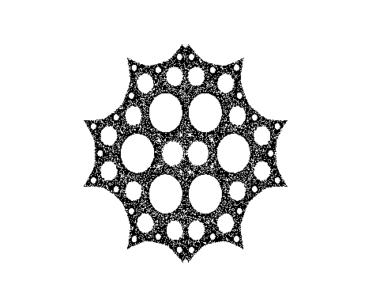



## Fractal Clouds

### Description

Fractal clouds are lesson 3. With this lesson we enter a realm of fractal graphics. Sometimes it is just amazing how simple it is to reveal beaty that is hidden is simple math with a little help of a computer.

Fractal clouds (or dust) start forming from a single user defined point P0(A,B,X,Y), and by numerous repeating of some transformation we get some cool pics. Because of the fact that we can follow the trail that start point is leaving behined (P0-start, P1-1st iteration, P2 2nd, .... Px - wich are dots on picture) this pics are also called orbitals (trajectories) of dynamic system.

To get a rude estimation of what A, B, X and Y are good to use - I prepared you Clouds.xls. Sheets 1 to 6 shows computation sequence series of here given pattern examples 1 to 6. X() sheets show graphic look of computation sequence of poorly picked parameters (with some comment why). Submission is 575k because of xls file.

Have fun with this code and share parameters if you get some cool pic of your own.
 
### More Info
 

             |
---                |---
**Submitted On**   |2011-03-19 22:55:42
**By**             |[Dolac](https://github.com/Planet-Source-Code/PSCIndex/blob/master/ByAuthor/dolac.md)
**Level**          |Beginner
**User Rating**    |4.5 (18 globes from 4 users)
**Compatibility**  |VB 5\.0, VB 6\.0
**Category**       |[Math/ Dates](https://github.com/Planet-Source-Code/PSCIndex/blob/master/ByCategory/math-dates__1-37.md)
**World**          |[Visual Basic](https://github.com/Planet-Source-Code/PSCIndex/blob/master/ByWorld/visual-basic.md)
**Archive File**   |[Fractal\_Cl2200233202011\.zip](https://github.com/Planet-Source-Code/dolac-fractal-clouds__1-73814/archive/master.zip)

